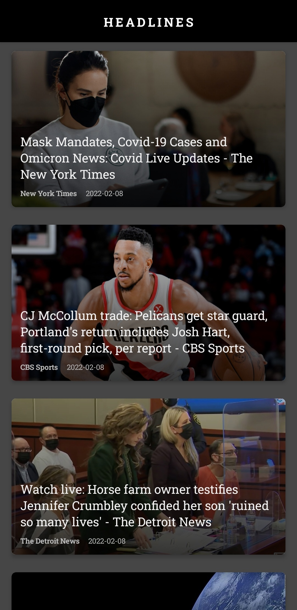
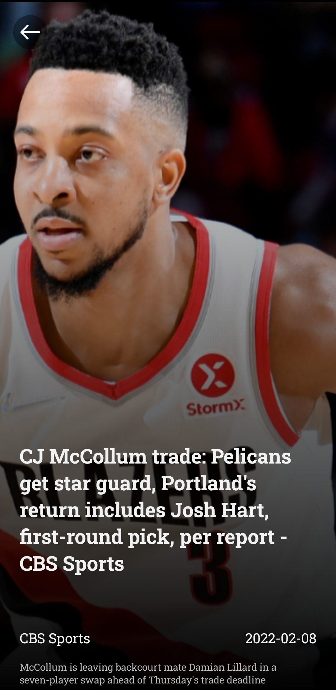

# Headlines

A simple app to view the latest headlines and details. The app is built completely in Jetpack Compose. Following components and libraries have been used and demonstrated:

- MVVM Architecture
- Dependency Injection using Koin
- Network calls using Retrofit + RxJava/RxAndroid
- Navigation with Compose
- Animation with Compose
- Lottie Animations
- Image loading with Coil
- Accompanist for
    - System UI Controls
    - Swipe Refresh
    - Shimmer Effect
- Room DB for caching
- ConstraintLayout
- Offline/Online state observation

## Screenshots

